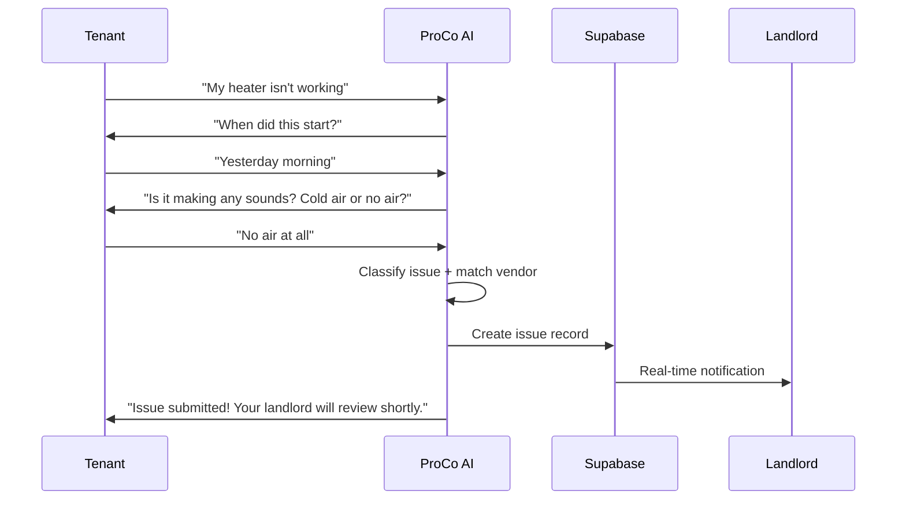
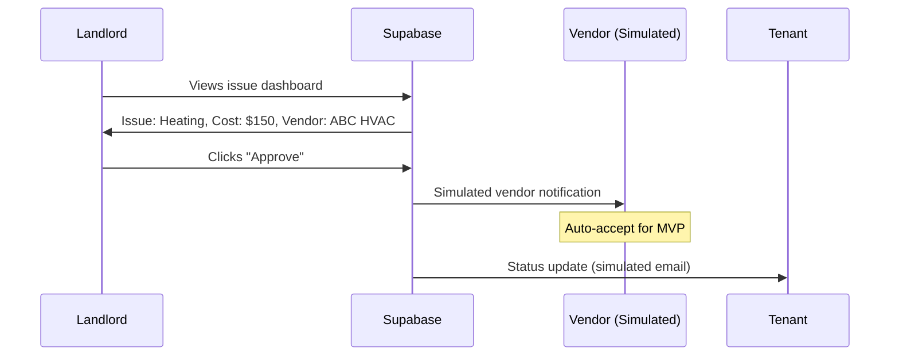
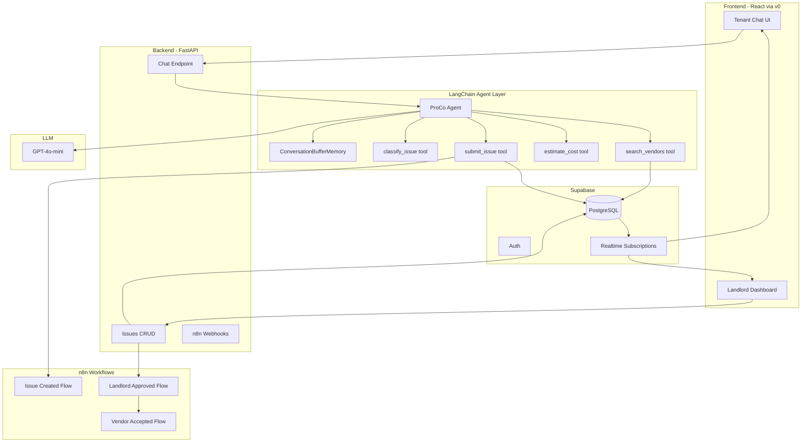
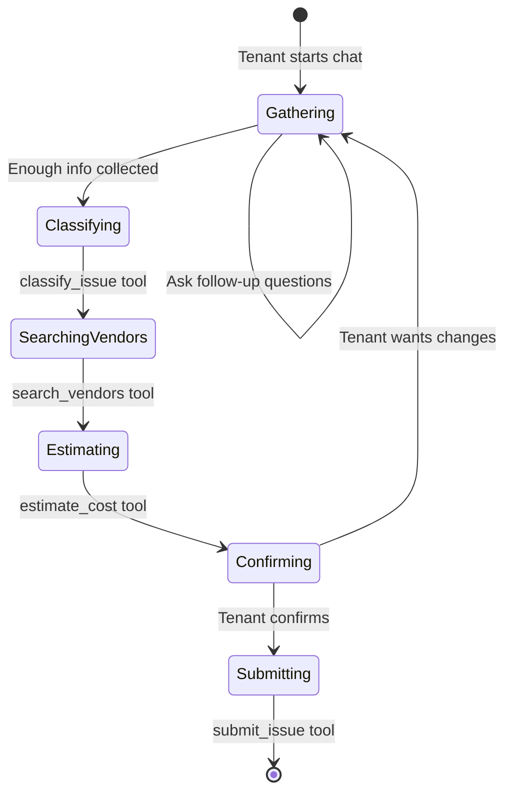
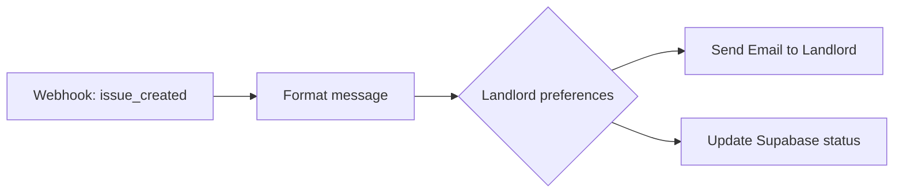
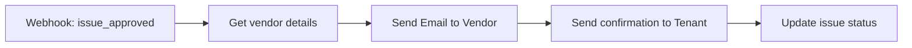
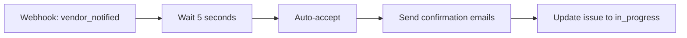

# ProCo MVP Specification

## Product Name Suggestions

- **ProCo** (Property Coordinator) - your current choice, works well
- **FixFlow** - emphasizes the workflow from issue to resolution
- **TenantBridge** - highlights the connection between parties
- **RepairRelay** - captures the handoff nature

---

## Core Value Proposition

An AI-powered property management tool that automates issue collection from tenants, matches vendors based on budget, and streamlines landlord approvals - reducing back-and-forth communication by 80%.

---

## MVP Scope (24-hour Hackathon)

### What's IN

- Tenant chat interface with real AI (issue collection)
- Landlord dashboard with issue table + approve/reject
- Pre-seeded vendor database
- Simulated vendor matching based on issue type
- Basic Supabase auth (landlord + tenant roles)
- Real-time updates when issues are created/approved

### What's OUT (Post-MVP)

- Full vendor dashboard
- Email/SMS notifications (mock in demo)
- Payment integration
- Multi-property support
- Tenant availability calendar
- Vendor reviews/ratings
- Budget configuration UI

---

## User Flows

### Flow 1: Tenant Reports Issue



### Flow 2: Landlord Approves



---

## Technical Architecture



---

## Data Models (Supabase Tables)

### users

| Column      | Type   | Notes                                    |
| ----------- | ------ | ---------------------------------------- |
| id          | uuid   | Primary key                              |
| email       | string |                                          |
| role        | enum   | 'tenant', 'landlord'                     |
| name        | string |                                          |
| property_id | uuid   | FK to properties (nullable for landlord) |

### properties

| Column      | Type   | Notes       |
| ----------- | ------ | ----------- |
| id          | uuid   | Primary key |
| address     | string |             |
| landlord_id | uuid   | FK to users |

### issues

| Column         | Type      | Notes                                             |
| -------------- | --------- | ------------------------------------------------- |
| id             | uuid      | Primary key                                       |
| tenant_id      | uuid      | FK to users                                       |
| property_id    | uuid      | FK to properties                                  |
| category       | enum      | 'heating', 'plumbing', 'electrical', 'other'      |
| summary        | string    | AI-generated summary                              |
| description    | text      | Full chat transcript/details                      |
| status         | enum      | 'pending', 'approved', 'in_progress', 'completed' |
| vendor_id      | uuid      | FK to vendors (matched)                           |
| estimated_cost | decimal   |                                                   |
| created_at     | timestamp |                                                   |

### vendors (Pre-seeded)

| Column      | Type    | Notes                                          |
| ----------- | ------- | ---------------------------------------------- |
| id          | uuid    | Primary key                                    |
| name        | string  |                                                |
| specialty   | enum    | 'heating', 'plumbing', 'electrical', 'general' |
| hourly_rate | decimal |                                                |
| rating      | decimal | For future use                                 |

### chat_messages

| Column     | Type      | Notes                                       |
| ---------- | --------- | ------------------------------------------- |
| id         | uuid      | Primary key                                 |
| issue_id   | uuid      | FK to issues (nullable until issue created) |
| tenant_id  | uuid      | FK to users                                 |
| role       | enum      | 'user', 'assistant'                         |
| content    | text      |                                             |
| created_at | timestamp |                                             |

---

## API Endpoints (FastAPI)

### Chat

- `POST /api/chat` - Send message, get AI response
  - Input: `{ tenant_id, message, conversation_id? }`
  - Output: `{ response, issue_created?, issue_id? }`

### Issues

- `GET /api/issues` - List issues (filtered by role)
- `GET /api/issues/{id}` - Get issue details
- `PATCH /api/issues/{id}/approve` - Landlord approves
- `PATCH /api/issues/{id}/reject` - Landlord rejects

### Vendors

- `GET /api/vendors` - List vendors (internal use)

---

## LangChain Agent Architecture

### Agent Setup

```python
from langchain.agents import AgentExecutor, create_openai_tools_agent
from langchain.memory import ConversationBufferMemory
from langchain_openai import ChatOpenAI
from langchain.tools import tool
from langchain_core.prompts import ChatPromptTemplate, MessagesPlaceholder

# Initialize LLM - GPT-4o-mini: fast, cheap, excellent tool calling
llm = ChatOpenAI(
    model="gpt-4o-mini",
    temperature=0.7
)
# Cost: ~$0.15/1M input, ~$0.60/1M output tokens

# Conversation memory (per tenant session)
memory = ConversationBufferMemory(
    memory_key="chat_history",
    return_messages=True
)

# Create agent with tools
prompt = ChatPromptTemplate.from_messages([
    ("system", SYSTEM_PROMPT),
    MessagesPlaceholder(variable_name="chat_history"),
    ("human", "{input}"),
    MessagesPlaceholder(variable_name="agent_scratchpad"),
])

agent = create_openai_tools_agent(llm, tools, prompt)
agent_executor = AgentExecutor(agent=agent, tools=tools, memory=memory, verbose=True)
```

### Agent Tools

```python
@tool
def classify_issue(description: str) -> dict:
    """Classify the issue into a category based on the description.
    Returns category (heating/plumbing/electrical/other) and severity."""
    # Uses LLM to classify based on collected info
    pass

@tool
def search_vendors(category: str, max_budget: float = None) -> list:
    """Search for available vendors matching the issue category.
    Optionally filter by budget. Returns list of vendors with rates."""
    # Queries Supabase vendors table
    pass

@tool
def estimate_cost(vendor_id: str, issue_severity: str, category: str) -> dict:
    """Estimate the repair cost based on vendor rates and issue complexity.
    Returns estimated cost and breakdown."""
    pass

@tool
def submit_issue(
    tenant_id: str,
    category: str,
    summary: str,
    description: str,
    severity: str,
    vendor_id: str,
    estimated_cost: float
) -> dict:
    """Submit the fully scoped issue to the database.
    Creates the issue record and notifies the landlord."""
    # Inserts into Supabase issues table
    pass
```

### Agent System Prompt

```
You are ProCo, an AI assistant helping tenants report property maintenance issues.

Your workflow:
1. GATHER INFO: Ask about the problem, when it started, severity, and relevant details
2. CLASSIFY: Once you have enough info, use classify_issue to categorize
3. FIND VENDORS: Use search_vendors to find available service providers
4. ESTIMATE: Use estimate_cost to get a cost estimate
5. CONFIRM: Summarize everything for the tenant and ask for confirmation
6. SUBMIT: Use submit_issue to create the ticket

Be conversational and empathetic. Gather information efficiently - don't ask too many questions.
When you have category, description, severity, and tenant confirmation, proceed to submit.

Available tools: classify_issue, search_vendors, estimate_cost, submit_issue
```

### Agent Flow Diagram



---

## v0 UI Generation

Use v0.dev to quickly scaffold the React components. Prompt examples:

### Tenant Chat Screen

```
Create a modern chat interface for a property maintenance app called ProCo.
- Clean header with logo and "Report an Issue" title
- Chat message list with user/assistant bubbles
- Input field with send button at bottom
- Show typing indicator when AI is responding
- Use shadcn/ui components, Tailwind CSS
- Mobile-responsive design
```

### Landlord Dashboard

```
Create a property management dashboard for landlords.
- Stats cards at top: Open Issues, Pending Approval, Monthly Spend
- Data table with columns: Issue Summary, Category (with colored badge), 
  Tenant Name, Suggested Vendor, Estimated Cost, Actions
- Action buttons: green "Approve" and red "Reject"
- Clean, professional design with shadcn/ui and Tailwind
- Include a header with "ProCo Dashboard" title
```

---

## n8n Workflow Automation

### Workflow 1: Issue Created

Triggered when tenant submits issue via LangChain agent.



### Workflow 2: Landlord Approves

Triggered when landlord clicks "Approve" on dashboard.



### Workflow 3: Vendor Accepts (Simulated for MVP)

For MVP, auto-accept after short delay to simulate vendor response.



### n8n Webhook Endpoints

- `POST /webhook/issue-created` - Called by submit_issue tool
- `POST /webhook/issue-approved` - Called by FastAPI when landlord approves
- `POST /webhook/vendor-accepted` - Called to complete the flow

---

## UI Wireframes (Simplified)

### Tenant Chat Screen

- Header: "ProCo - Report an Issue"
- Chat message list (scrollable)
- Input field + send button
- Status indicator for submitted issues

### Landlord Dashboard

- Header: "ProCo - Property Dashboard"
- Stats cards: Open Issues, Pending Approval, Monthly Spend
- Table columns:
  - Issue Summary
  - Category (with icon/badge)
  - Tenant
  - Suggested Vendor
  - Estimated Cost
  - Actions (Approve/Reject buttons)

---

## Suggested Time Allocation (24 hours)

| Phase           | Hours | Tasks                                                 |
| --------------- | ----- | ----------------------------------------------------- |
| Setup           | 2     | Supabase setup, project scaffolding, seed data        |
| LangChain Agent | 4     | Agent setup, 4 tools, memory, system prompt           |
| Backend API     | 3     | FastAPI endpoints + n8n webhook triggers              |
| n8n Workflows   | 2     | 3 workflows: issue created, approved, vendor accepted |
| Frontend (v0)   | 6     | Generate with v0, customize, connect to backend       |
| Integration     | 4     | Connect all pieces, real-time updates, test flows     |
| Polish          | 2     | Bug fixes, demo prep                                  |
| Buffer          | 1     | Unexpected issues                                     |

---

## Demo Script Suggestion

1. **Tenant logs in** - Show simple auth
2. **Tenant chats with AI** - "My sink is leaking" - AI asks follow-ups
3. **Issue appears on landlord dashboard** - Real-time update
4. **Landlord reviews** - See vendor suggestion + cost
5. **Landlord approves** - Status updates, simulated notification
6. **Show completed flow** - Tenant sees status change

---

## Tech Stack Summary

- **Frontend:** React + TypeScript + Tailwind CSS (generated with **v0**)
- **Backend:** FastAPI (Python)
- **Database:** Supabase (PostgreSQL + Auth + Realtime)
- **AI/Agent Framework:** **LangChain** + OpenAI GPT-4o-mini
- **Workflow Automation:** **n8n** (notifications and approval flows)
- **Deployment:** Vercel (frontend) + Railway/Render (backend)

### Prize Tracks Targeted

- **LangChain** - $2,000 in credits
- **v0** - $2,000 in credits  
- **n8n** - 1 year Pro license

### Python Dependencies (requirements.txt)

```
fastapi>=0.109.0
uvicorn>=0.27.0
langchain>=0.1.0
langchain-openai>=0.0.5
langchain-core>=0.1.0
supabase>=2.3.0
python-dotenv>=1.0.0
pydantic>=2.5.0
httpx>=0.26.0  # For n8n webhook calls
```
